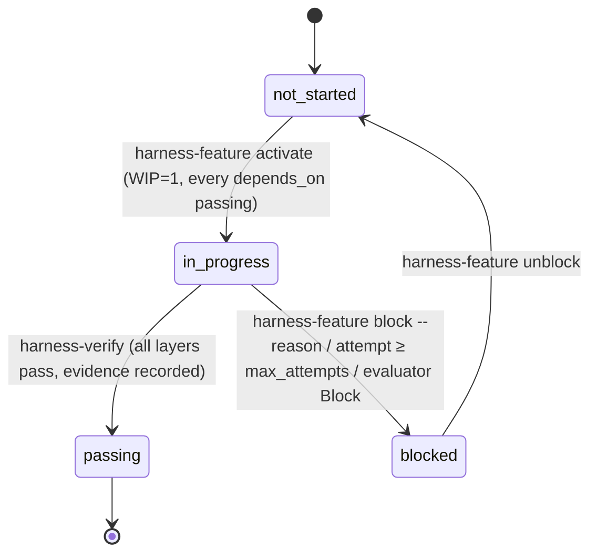

# How the Metsävahti harness works

The harness is the set of files, scripts and hooks that let a coding agent work on this repository
one feature at a time without drifting, and let a driver run those sessions unattended. This page
explains the parts, the flow of one feature, what each safeguard catches, how to operate the
automated loop and where its limits are. It follows the course
[learn-harness-engineering](https://github.com/walkinglabs/learn-harness-engineering) (lectures 1–13)
and Anthropic's harness articles; the decisions behind it are D-007 and D-008 in
[../DECISIONS.md](../DECISIONS.md).

## 1. The parts

| Part                 | Files                                                                                                                                                                                  | Role                                                                                                                                                                                              |
| -------------------- | -------------------------------------------------------------------------------------------------------------------------------------------------------------------------------------- | ------------------------------------------------------------------------------------------------------------------------------------------------------------------------------------------------- |
| Instructions         | [AGENTS.md](../../AGENTS.md), [CLAUDE.md](../../CLAUDE.md)                                                                                                                             | The operating manual every session reads: clock-in, verification layers, constraints with `why:`, definition of done, clock-out. CLAUDE.md adds Claude Code wiring.                               |
| State                | [feature_list.json](../../feature_list.json), [PROGRESS.md](../../PROGRESS.md), [DECISIONS.md](../DECISIONS.md)                                                                        | The queue (one entry per ticket, `depends_on`, `verification[]`, `evidence[]`), the session log, the architecture decisions. The repository, not the chat, remembers.                             |
| Spec and design      | [../product/](../product/) (spec, tickets, [deviations ledger](../product/00-deviations.md)), [../design/](../design/) (artboards, tokens, design map)                                 | What to build. A feature's `spec` field points at its ticket heading, `design` at its artboard.                                                                                                   |
| Verification         | `pnpm check` (L1), `pnpm test:integration` (L2), `pnpm test:e2e` (L3)                                                                                                                  | Named layers; a feature lists the exact commands it needs. `manual:` steps are human-only.                                                                                                        |
| Scripts              | `scripts/validate-feature-list.ts`, `harness-feature.ts`, `verify-feature.ts`, `clean-state-check.sh`, `import-tickets.ts`, `harness-loop.ts`                                          | Every state transition and every gate is a script with an exit code (`pnpm harness:*`). Skills and the driver call them; nobody edits `feature_list.json` by hand.                                |
| Claude Code wiring   | `.claude/settings.json`, `.claude/hooks/*`, `.claude/skills/*`, `.claude/agents/evaluator.md`                                                                                          | Permissions (allow/deny), hooks (SessionStart summary, PreToolUse guard, PostToolUse Prettier, opt-in Stop guard), skills (`/clock-in`, `/verify-feature`, `/clock-out`), the evaluator subagent. |
| Driver               | `scripts/harness-loop.ts`, [harness.config.json](../../harness.config.json), [prompts/](prompts/)                                                                                      | Runs the loop unattended: worktree per feature, generator session, deterministic post-check, evaluator session, PR.                                                                               |
| Observability        | `.harness/traces/*.jsonl`, `.harness/runs.jsonl` (gitignored), PR bodies, `PROGRESS.md`                                                                                                | Full `stream-json` trace of every session, one line per run, human-readable summaries.                                                                                                            |
| Templates and rubric | [clean-state-checklist.md](clean-state-checklist.md), [evaluator-rubric.md](evaluator-rubric.md), [session-handoff.md](session-handoff.md), [quality-document.md](quality-document.md) | The judgement half of the checklists, the scoring rubric (with its machine-output contract and tuning log), handoff notes, quality grades.                                                        |

## 2. One feature, two ways to run it

### Interactive (a human starts the session)

```
/clock-in F-042          pnpm harness:feature next → show → activate      (WIP=1, deps passing)
   implement             read spec + design, obey AGENTS.md constraints
/verify-feature F-042    pnpm harness:verify F-042   → L1 → L2 → L3 → evidence → passing
/clock-out               scripts/clean-state-check.sh + judgement checklist → PROGRESS.md → commit
```

### Driver-run (`pnpm harness:loop`)

```mermaid
sequenceDiagram
    participant D as Driver (harness-loop.ts)
    participant G as Generator session (claude -p)
    participant S as Scripts (harness-feature / verify / clean-state)
    participant E as Evaluator session (claude -p --agent evaluator)
    participant GH as GitHub (gh)

    D->>D: preflight: main clean & in sync, harness:check, Docker, db:up, gh, claude
    D->>S: harness-feature next (skip in-flight branches)
    S-->>D: F-042
    D->>D: git worktree add ../metsavahti-worktrees/F-042 -b feat/F-042 main; FAST=1 ./init.sh
    D->>G: prompt (prompts/generator.md), env HARNESS_LOOP=1 HARNESS_STOP_GUARD=1, caps
    G->>S: /clock-in → activate; implement; /verify-feature → harness:verify; /clock-out → clean-state, commit
    Note over G: Stop hook blocks stopping until clean-state passes (max 3×)
    G-->>D: result line: turns, cost, denials
    D->>S: post-check in the worktree: status passing|blocked, clean-state --require-terminal, commits ahead
    alt post-check fails
        D->>S: harness-feature attempt (auto-blocks at max_attempts) → retry once with the failure appended
    end
    D->>E: evaluate F-042 (rubric, JSON schema), different model, fresh context
    E-->>D: verdict Accept | Revise | Block + scores + findings
    alt Revise
        D->>G: retry once with the findings appended
    else Block
        D->>S: harness-feature block; push branch; notify
    else Accept
        D->>GH: git push; gh pr create (evidence, verdict, cost, trace path)
        D->>GH: wait for merge (or gh pr merge --auto --squash with --auto-merge)
        D->>D: git worktree remove; git pull main; next feature
    end
```

### Feature state machine



`attempts` counts driver-run sessions; `max_attempts` (feature field or `caps.maxAttempts`) auto-blocks.
`ready` = `not_started` with every dependency `passing`; the driver additionally skips features with a
`manual:` step (human-only) and features whose branch already exists on `origin` (in flight).

## 3. What each safeguard catches

| Safeguard                                             | Catches                                                                                                                                                                                          | Where                                                       |
| ----------------------------------------------------- | ------------------------------------------------------------------------------------------------------------------------------------------------------------------------------------------------ | ----------------------------------------------------------- |
| Permission allow rules (`--allowedTools`, settings)   | The known-good pnpm/git path runs without prompts or classifier round-trips                                                                                                                      | `harness.config.json`, `.claude/settings.json`              |
| Auto-mode classifier                                  | Anything not on the allowlist is reviewed by a second model; `--permission-prompts none` denies what would have prompted                                                                         | Claude Code                                                 |
| Deny rules                                            | `.env`, generated files, `db:reset`, `compose down -v`, force push, `reset --hard` — in every mode                                                                                               | `.claude/settings.json`                                     |
| `guard.sh` (PreToolUse)                               | Bare `vitest`/`playwright`, npm/yarn/npx, destructive git, `rm -rf`; invalid `feature_list.json` before a commit; in loop mode also `db:up/down`, `git push`, `checkout main`, worktree commands | `.claude/hooks/guard.sh`                                    |
| `harness:check` (validator)                           | Two `in_progress`, `passing` without evidence, unknown or cyclic `depends_on`, `in_progress` with unmet deps                                                                                     | runs from unit tests, lint-staged, the guard and the driver |
| `harness:verify`                                      | A layer skipped or run out of order; Docker missing for L2/L3; `manual:` steps waived unattended                                                                                                 | the only way a feature becomes `passing`                    |
| `clean-state-check.sh`                                | Dirty tree, `.only`/`.skip`, lowered thresholds, `console.log`, missing PROGRESS.md update, staged `.env`, broken AGENTS.md marker, broken `init.sh`                                             | clock-out, Stop hook, driver post-check                     |
| Stop hook (`stop-guard.sh`, loop only)                | A session ending with an unverified or uncommitted feature (max 3 blocks, respects `stop_hook_active`)                                                                                           | `.claude/hooks/stop-guard.sh`                               |
| Driver post-check                                     | A transcript that claims success while the branch says otherwise (status, clean-state, no commits)                                                                                               | `scripts/harness-loop.ts`                                   |
| Evaluator (fresh context, different model, read-only) | Work that passes its own tests but misses the behaviour, scope creep, stale evidence, bad handoff                                                                                                | `.claude/agents/evaluator.md`, `evaluator-rubric.md`        |
| Caps                                                  | Runaway sessions: turns, budget, wall clock, attempts, consecutive failures                                                                                                                      | `harness.config.json`                                       |
| CI on the PR                                          | Everything again on a clean runner (lint → typecheck → unit → integration → build → e2e)                                                                                                         | `.github/workflows/ci.yml`                                  |
| Design-system lint                                    | Arbitrary Tailwind values, raw palette colours, unknown classes, inline styles                                                                                                                   | `eslint.config.mjs`, part of L1                             |

## 4. Operating the loop

**Prerequisites (once):** Docker Desktop running, `gh` installed and logged in
(`brew install gh && gh auth login`), `main` clean and in sync with `origin/main`, Playwright
browsers installed (`pnpm exec playwright install chromium webkit`).

**Commands**

| Command                                   | What it does                                                                                                |
| ----------------------------------------- | ----------------------------------------------------------------------------------------------------------- |
| `pnpm harness:loop --dry-run --no-docker` | Prints the worktree commands and the exact `claude` invocations for the next ready feature; runs nothing.   |
| `pnpm harness:loop --once`                | One feature end to end, then stops. Use this for the first runs.                                            |
| `pnpm harness:loop --feature F-020`       | This feature only (it must be ready and unattended-capable).                                                |
| `pnpm harness:loop`                       | Loop until nothing is ready, a stop condition hits, or Ctrl-C (finishes the current session first).         |
| `--auto-merge`                            | `gh pr merge --auto --squash --delete-branch` instead of waiting for you.                                   |
| `--no-wait`                               | Do not wait for the merge; continue with features that do not depend on the open PR.                        |
| `pnpm harness:report`                     | Table of past runs from `.harness/runs.jsonl` (feature, attempt, outcome, verdict, turns, cost, PR).        |
| `pnpm harness:feature list`               | Queue overview with `[ready]` / `[ready, human-only]` markers.                                              |
| `pnpm harness:import-tickets [--write]`   | Re-import `docs/product/tickets` after editing a ticket (never touches `in_progress` / `passing` features). |

Run it in tmux; the driver prints one line per assistant message and tool call and sends a macOS
notification at every terminal state (PR ready, blocked, queue empty, failure cap).

**Reading a run.** `.harness/traces/F-NNN-<timestamp>.generator.jsonl` is the full stream
(`--include-hook-events`, so hook blocks are visible); the `result` line at the end carries
`num_turns`, `total_cost_usd`, `permission_denials`. The evaluator's JSON is next to it. The PR body
repeats the evidence lines, the verdict table and the cost.

**Intervening.** Merge or close the PR (a closed PR stops the loop for that feature); unblock a feature
with `pnpm harness:feature unblock F-NNN` after fixing the cause; edit the ticket or the deviations
ledger and re-import; lower or raise the caps in `harness.config.json`; add an allow rule when
`permission_denials` shows the same legitimate command denied twice. After each of the first 3–5 runs,
compare the evaluator's scores with your own and record the rubric change in its tuning log.

**Cost expectations.** A small library feature (unit tests only) runs in 20–60 turns and a few dollars;
a cross-component feature with L2/L3 can use most of the 200-turn / 15 USD / 60-minute caps. The
evaluator is capped at 60 turns / 4 USD.

## 5. Limits and the next stage

- **Sequential only.** L3 uses fixed ports (3100, 3200, 5433, 8025) and `.next-e2e`, and Docker
  Compose uses fixed container names, so one feature runs at a time and `pnpm db:up` runs only from
  the main checkout (the guard blocks it inside a worktree).
- **Human-only features.** Anything with a `manual:` step (ops, launch, WFS discovery with network)
  stays interactive; `harness:verify --allow-manual` is for a person who performed the step.
- **Not a sandbox.** Sessions run on the host with the classifier and the deny list as the boundary;
  `bypassPermissions` is deliberately not used (D-008). Put the driver in a container before raising caps
  or loosening the allowlist.
- **State files on branches.** Every PR touches `feature_list.json` and `PROGRESS.md`; the default
  `merge: "wait"` policy avoids conflicts by finishing one PR before the next dependent feature starts.
- **Phase 3 (graph stage, lecture 14).** Parallel workers on features with disjoint `area` and satisfied
  `depends_on`, one worktree each with parametrised ports and `NEXT_DIST_DIR`, an `owner` field on
  `in_progress` features and a per-worker WIP=1. The swarm schedule in
  [../product/04-delivery-plan.md](../product/04-delivery-plan.md) is the target shape for that stage.

Phase-2 brief and history: [phase-2-automated-loop.md](phase-2-automated-loop.md).
